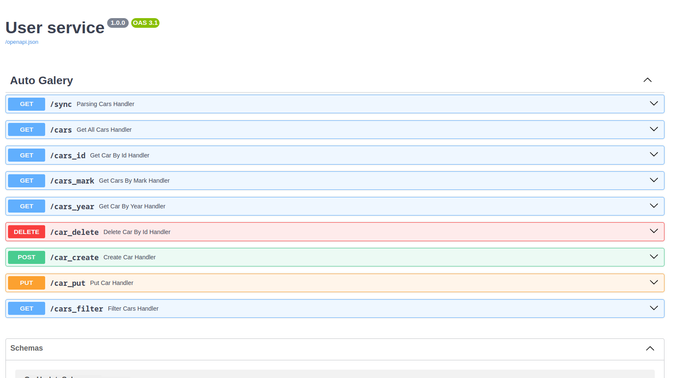

# FastAPI Parser

Test Project for parsing OLX and manipulate received data

## API's

* `Get /sync` - parsing data from OLX. Recommend set 'offset'= 1 (Because the wait may be too long)
* `Get /cars` - getting all cars
* `Get /cars_id` - getting car by ID
* `Get /cars_mark` - getting cars by Mark
* `Get /cars_year` - getting cars by years
* `Delete /car_delete` - deleting car by ID
* `Post /car_create` - creating car
* `Put /car_put` - change data car
* `Get /cars_filter` - filtering cars by: year, price, mileage.

### Installation and Running



These instructions will help you run the project.

## Requirements

Ensure you have the following software installed:

- [Docker](https://www.docker.com/get-started)
- [Docker Compose](https://docs.docker.com/compose/install/)
- [GNU Make](https://www.gnu.org/software/make/)

___
## Installation

1. **Clone the repository:**
   ```bash
   git clone https://github.com/podrivnick/TestParsingAuto.git
   cd TestParsingAuto
   ```

2. Install all required packages in `Requirements` section.
3. Set up environment variables:
   - Create a `.env` file and fill it according to `.env.example`.

### Implemented Commands

* `make app` - up application and database/infrastructure
* `make app-logs` - follow the logs in app container
* `make app-down` - down application and all infrastructure
* `make mongo` - up database

### Specific Commands

* `make appbash` - enter into application container bash
* `make dbbash` - enter into postgres container bash
* `make runtest` - run all tests


## Technology
+ **FastAPI**
+ **Python**
+ **Docker**
+ **Mongo**

## Author
Author of the backend: ***Rybakov Artem***  (https://github.com/podrivnick)
